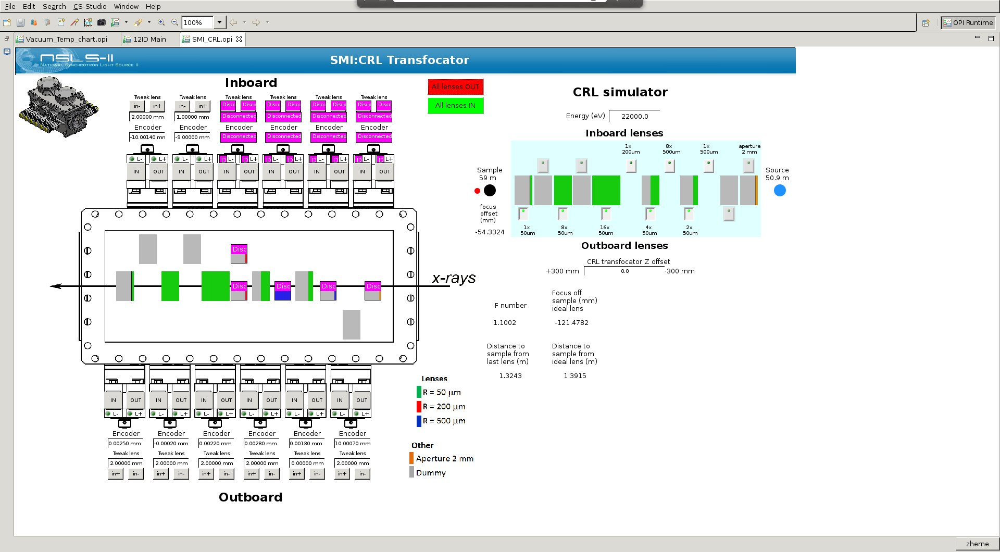

### bnlcrl

Simulator of the compound refractive lenses (CRL).

Learn more at https://github.com/mrakitin/bnlcrl.

Documentation: http://bnlcrl.readthedocs.org/en/latest/

----
The code is written in pure Python, tested to be working under Linux and Windows with Python 2.7/3.5 and Jython 2.7. There is no required NumPy dependency, but it still can be used for operations with matrices, etc. (see the `Usage` section below).

`CRL` is a library containing the following:
- `CRL/CRL.py` is a module containing the `CRL` class;
- `CRL/crl_console.py` is a script to perform calculations from console using the following (main) input parameters:
 - a list of identificators of the active cartridges (`-c/--cart_ids`);
 - photon energy (`-e/--energy`);
 - distance to the first lens (`-p/--p0`).

Usage:
-
```
usage: crl_console.py [-h] -c [CART_IDS [CART_IDS ...]] [-b BEAMLINE]
                      [--d_ssa_focus D_SSA_FOCUS] [-d DATA_FILE]
                      [--dl_cart DL_CART] [--dl_lens DL_LENS] [-e ENERGY]
                      [--lens_array [LENS_ARRAY [LENS_ARRAY ...]]]
                      [-o OUTFILE] [-f OUTPUT_FORMAT] [-p P0]
                      [--r_array [R_ARRAY [R_ARRAY ...]]] [-t TETA0] [-n]

Calculate real CRL under-/over-focusing comparing with the ideal lens.

optional arguments:
  -h, --help            show this help message and exit
  -c [CART_IDS [CART_IDS ...]], --cart_ids [CART_IDS [CART_IDS ...]]
                        cartridges ids.
  -b BEAMLINE, --beamline BEAMLINE
                        beamline name.
  --d_ssa_focus D_SSA_FOCUS
                        Distance from SSA??? [m].
  -d DATA_FILE, --data_file DATA_FILE
                        data file with delta values for the material of the
                        CRL (e.g., Be).
  --dl_cart DL_CART     distance between centers of two neighbouring
                        cartridges [m].
  --dl_lens DL_LENS     distance between two lenses within a cartridge [m].
  -e ENERGY, --energy ENERGY
                        photon energy [eV].
  --lens_array [LENS_ARRAY [LENS_ARRAY ...]]
                        possible number of lenses in cartridges.
  -o OUTFILE, --outfile OUTFILE
                        output file.
  -f OUTPUT_FORMAT, --output_format OUTPUT_FORMAT
                        output file format (CSV, JSON, plain text).
  -p P0, --p0 P0        distance from z=50.9 m to the first lens in the most
                        upstream cartridge at the most upstream position of
                        the transfocator [m].
  --r_array [R_ARRAY [R_ARRAY ...]]
                        radii of available lenses in different cartridges
                        [um].
  -t TETA0, --teta0 TETA0
                        divergence of the beam before CRL [rad].
  -n, --use_numpy       use NumPy for operations with matrices.
```

Examples of execution:
-
```bash
$ python CRL/crl_console.py -c 2 4 6 7 8 -e 21500 -p 6.52 -f json
{
    "d": 0.0003724552768691325,
    "d_ideal": -0.0669574652539282,
    "f": 1.048643779215436,
    "p0": 6.52,
    "p1": 1.2496275447231306,
    "p1_ideal": 1.3169574652539293
}
```

```bash
$ python CRL/crl_console.py -c 2 4 6 7 8 -e 21500 -p 6.52 -f csv
"d","d_ideal","f","p0","p1","p1_ideal"
0.0003724552768691325,-0.0669574652539282,1.048643779215436,6.52,1.2496275447231306,1.3169574652539293
```

```
$ python CRL/crl_console.py -c 2 4 6 7 8 -e 21500 -p 6.52 -f txt
d: 0.0003724552768691325, d_ideal: -0.0669574652539282, f: 1.048643779215436, p0: 6.52, p1: 1.2496275447231306, p1_ideal: 1.3169574652539293
```

```
$ python CRL/crl_console.py -c -e 21500 -p 6.52
"d","d_ideal","f","p0","p1","p1_ideal"
0,0,0,6.52,0,0
```

This library is used on the SMI beamline at NSLS-II:


#### License

License: http://www.apache.org/licenses/LICENSE-2.0.html

Copyright (c) 2016 mrakitin.  All Rights Reserved.
